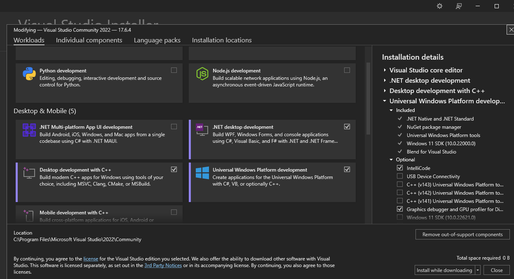
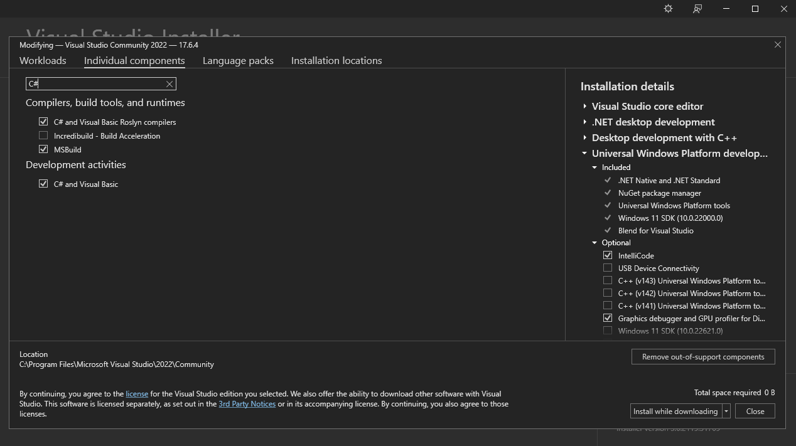
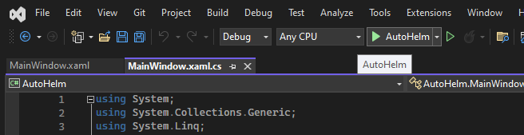

<div align="center">


### AutoHelm
A platform made for anyone to automate anything, with a simple drag-and-drop interface.

[]()

</div>

# Summary
A brief look at what AutoHelm is all about!

### Goals & Inspiration
All professions require some usage of computers whether it be for writing emails, editing documents, data entry, file management, or other similar activities. Many of these tasks are tedious and waste many hours in a person's day. This is a significant time drain that can be used for more productive work. The goal of AutoHelm is to offer a platform for users to automate repetitive computer tasks with visual programmable blocks and share their creations with others. AutoHelm has a number of subsystems working together to make the final product. A small overview of each of these subsystems can be found in this readme. 

### Technical Overview
In total, there are 4 subsystems that combine in order to make the product work. The first of these is a Windows Desktop application for users to create and run their own automated scripts, called "workflows". Next, is the automation subsystem that powers the scripts the users build behind the scenes, by saving the steps/functions used in our own custom-built programming language. This also includes a lexer and parser that can build an AST, and execute code via Python. The third subsystem is the Machine learning subsystem, powered by our Ubuntu server. We created a fine-tuned model based on a quantized version of Meta's Code Llama 13B model running on llama.cpp. This was built to handle requests from users in the desktop app through a REST API, and is meant to help guide users on how to start building what they want. It was trained to write in our custom language to handle this.

A diagram showing the interaction between all these subsystems can be found below:


# Desktop Application
The Desktop Application subsystem of AutoHelm fulfills its functional requirements, providing users with a seamless experience for workflow creation and deployment. Upon launching, users encounter a login page enabling access to existing accounts, new account registration, or guest usage. The home page displays recently accessed workflows, facilitating quick access to relevant projects. Users can create, open, or select workflows, initiating a drag-and-drop interface for constructing workflows on a canvas. Each drag and drop block represents a function whose parameters can then be edited through a pop-up window. Notably, draggable elements are converted to AHIL (AutoHelm Intermediate Language) code in the back-end (see Automation Subsystem). Upon completion, users can trigger workflow execution with the run button. Access to an AI assistant for workflow generation is also available through the app (see ML Model subsystem). The subsystem efficiently utilizes system resources, consuming a small amount of RAM during execution and very little disk space as well.

A screenshot from the create page in the desktop app can be found below. Here you can see the draggable function blocks on the right, which are then displayed and edited in the main center screen.


# Automation Framework
The Automation Subsystem in AutoHelm revolves around the AutoHelm Intermediate Language (AHIL), a versatile representation of automation tasks crafted within the desktop application. AHIL serves multiple purposes: facilitating workflow saving, enabling editing and sharing through the marketplace web app, and ensuring compatibility across platforms and automation technologies. The AHIL parser constructs an abstract syntax tree (AST) from AHIL, allowing for platform-specific automation script generation and recreation of equivalent workflow designs within the desktop app. AHIL's concise syntax and semantic focus simplify workflow creation and parsing phases, enhancing user experience. For backend automation, three options were considered: AutoHotKey, AHK(python), and PyAutoGUI. While AutoHotKey provides extensive Windows functionality, AHK(python) offers ease of use with Python familiarity. PyAutoGUI promises cross-platform compatibility but lacks certain critical features. 

A short description of the EBNF Grammar of AHIL can be found below:


Here is a short sample of AHIL code that creates and edits simple CSV files:
```
Del "..\..\..\tests\tests_output"
DirCreate "..\..\..\tests\tests_output"
For (5) {
    DirCreate "..\..\..\tests\tests_output\group_{i}"
    FileCreate "..\..\..\tests\tests_output\group_{i}\data_{i}.txt"
    Run "..\..\..\tests\tests_output\group_{i}\data_{i}.txt", "Notepad.exe"
    For (10) {
        WrtLine "{i},{i*10},{i*100}"
    }
    Sleep 500
    Save
    Close
}
```

# Marketplace
The Marketplace subsystem within AutoHelm serves as a central hub for managing and distributing workflows and facilitating cloud storage/access. Consisting of front-end and back-end components, users interact with the front-end via the marketplace website to log in, view private and public workflows, while the back-end, integrated with Google's Firebase system, manages user authentication, file storage, and database operations. Workflows are stored in Firebase storage, with each workflow corresponding to a record in the real-time database for efficient retrieval. Upon cloud-saving from the desktop app, C# code utilizing the Firebase API uploads files and creates database records, ensuring data integrity. The marketplace website, built with ReactJS and JavaScript, enables users to search for and download workflows, with authentication seamlessly handled through Firebase. This unified approach streamlines development, surpassing initial goals by offering public-private workflow capabilities and opting for Firebase over more complex, costly alternatives like separate servers or relational databases. The decision to utilize Firebase underscores its cost-effectiveness and data unification benefits, making it the cornerstone of the Marketplace subsystem's efficiency and convenience. 

You can find a sample screenshot of what the marketplace's explore page looks like below:


# Machine Learning Model
The ML Model Subsystem in AutoHelm employs advanced technologies like Code Llama 13B and llama.cpp to streamline workflow creation. Through the desktop application's chat interface, user prompts our fine-tuned model hosted on an Ubuntu server, facilitated by an Express.js REST API. This model is ran through llama.cpp, and interprets inputs, then generates AHIL code snippets tailored to workflow requirements. Notably, the custom-trained model, is based upon a quantized version of Code Llama 13B, trained using LoRA on llama.cpp, further optimizes server response time and efficiency. This technical integration abstracts AHIL syntax and block interface complexities, making workflow creation accessible to users of all programming backgrounds. It is meant to act as a starting point for how to create workflows, to help bridge the gap for new-comers. The final model is saved in a .gguf file on our server. The repo here simply contains files/data used for training and running the model throughout the creation process.

To find out more about the Meta's LLama 2 model, please refer to their [website](https://llama.meta.com/) summarizing the information, or for more detailed info on the model we used, refer to [this page](https://ai.meta.com/blog/code-llama-large-language-model-coding/) about Code Llama. Furthermore, the research papers that we used to help us understand core aspects of the LLM can be found [here](https://ai.meta.com/research/publications/llama-2-open-foundation-and-fine-tuned-chat-models/) and also [here](https://ai.meta.com/research/publications/code-llama-open-foundation-models-for-code/). Finally, you can find out more about llama.cpp through their [github repo](https://github.com/ggerganov/llama.cpp). Special thanks to the contributors of llama.cpp to help make this possible.

Shown below you will find what the prompt window looks like in the desktop app. A user can click the small lightbulb button next to the run button to open this window and type a request of what they are looking for.


# Desktop_Application

## Pulling and Cloning READ THIS
When u pull from Desktop_Application, use:
```
git pull --recurse-submodules
```

to update the submodule to the latest commit (i.e. use the latest automation framework when working on the desktop app) use:
```
git submodule update --remote --merge
```
and then add/push the updates (this will update to use the latest framework commit as submodule reference)

The automation framework repo can be seen from the desktop app

I would still recommend if u are making automation framework changes, pls work straight off the automation framework repo and not the desktop application repo

## Insalling Visual Studio
Download Community 2022 version of Visual Studio [here](https://visualstudio.microsoft.com/vs/)

- Check all the Desktop related sections for development. Prob not all needed, but used just in case


- Add C# tools as part of Individual components


- Run from the top here

